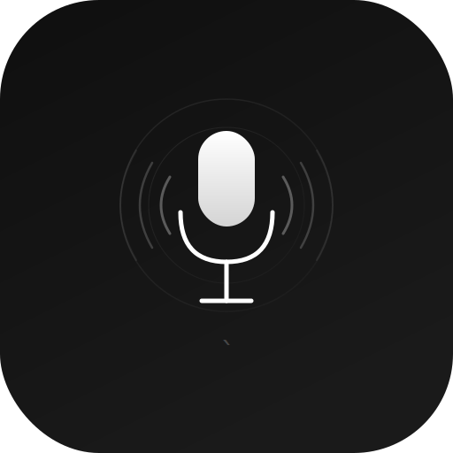
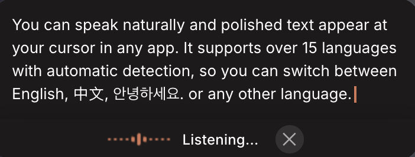
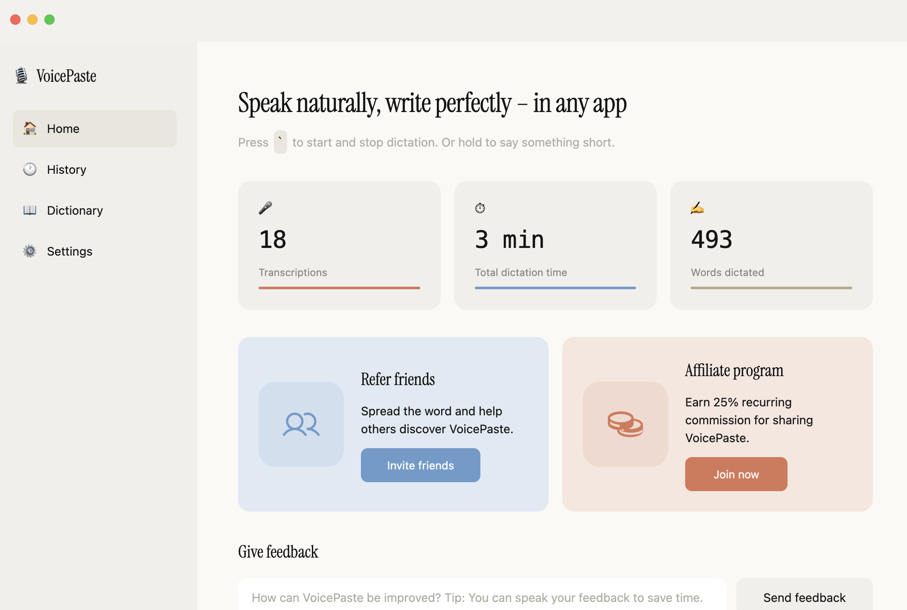
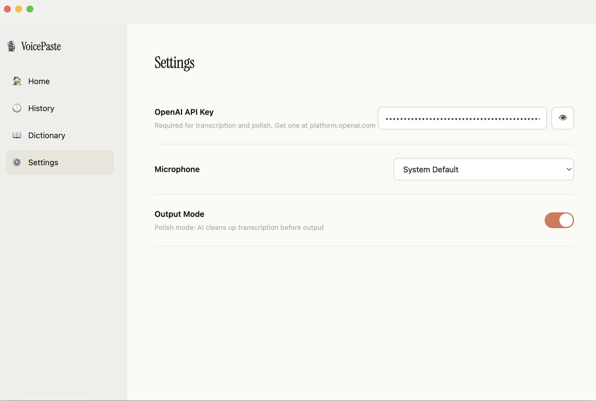

<p align="center">
  
</p>

<h1 align="center">VoicePaste</h1>

<p align="center">
  <strong>Speak naturally, paste perfectly — in any app.</strong>
</p>

<p align="center">
  <a href="README-zh.md">简体中文</a> | English
</p>

<p align="center">
  
  
  
</p>

---

VoicePaste is a **local, open-source** voice-to-text tool for macOS.
Press one key, speak, and polished text appears at your cursor — in any app. No account required. Bring your own OpenAI API key.

> **All data stays on your machine.** History, dictionary, and settings are stored as local JSON files. Nothing is sent anywhere except OpenAI's API for transcription.

<p align="center">
  
  &nbsp;&nbsp;&nbsp;&nbsp;
  
</p>

## How It Works

```
 ┌─────────┐     ┌───────────────┐     ┌───────────┐     ┌─────────┐
 │ 🎙️ Speak │ ──▶ │ OpenAI        │ ──▶ │ AI Polish │ ──▶ │ 📋 Paste │
 │         │     │ Realtime API  │     │ (GPT)     │     │         │
 └─────────┘     └───────────────┘     └───────────┘     └─────────┘
```

1. Press <kbd>\`</kbd> (the key below `Esc`) to start recording
2. Speak naturally — supports **50+ languages** with automatic language detection
3. Press <kbd>\`</kbd> again to stop
4. Text is transcribed in real-time, polished by AI, and pasted at your cursor

The entire pipeline — record, transcribe, polish, paste — typically completes within **1–2 seconds** after you stop speaking.

> **Recommended hotkey:** We suggest using <kbd>\`</kbd> (backtick, right below <kbd>Esc</kbd>). It's easy to reach and rarely conflicts with other shortcuts.

## Quick Start

```bash
git clone https://github.com/junyuw2289-svg/voicepaste.git
cd voicepaste
npm install
npm start
```

On first launch, go to **Settings** and paste your [OpenAI API key](https://platform.openai.com/api-keys). That's it.

### Requirements

- Node.js >= 18
- macOS (Accessibility permission required for auto-paste)

## Features

### AI Polish (Default: ON)

Raw speech is messy — VoicePaste cleans it up before pasting. The built-in polish prompt:

- Removes filler words (`uh`, `um`, `like`, `嗯`, `那个`, `えーと`, `저기`...)
- Structures multi-point speech into **numbered lists**
- Preserves code-switching — every word stays in its original language, never translates
- Matches the tone of a well-written Slack message

Toggle polish off in **Settings** → **Output Mode** for raw transcription (Fast Mode).

> **The polish prompt is fully customizable** — edit `src/main/openai-service.ts` to tune how your speech gets cleaned up.

### Multi-Language Support

VoicePaste supports **50+ languages** out of the box — English, Chinese, Japanese, Korean, Spanish, French, German, and many more. Language is detected automatically, no manual switching needed.

**Code-switching friendly:** Switch between languages mid-sentence. Say "오늘 meeting 에서 discuss 한 내용" or "我们需要 update 一下" — each word stays in its original language.

### Context-Aware Transcription

VoicePaste captures the **active app name**, **window title**, and **selected text** before transcribing. This helps the polish model understand technical terms and variable names in context.

### Dictionary

Add proper nouns, jargon, or names that the transcription model might misspell. These terms are injected into the transcription prompt so the model gets them right the first time.

*Example: Add "Supabase", "Zustand", "Tailwind" to avoid common mishearings.*

### History & Dashboard

Every transcription is saved locally as a JSON file. The dashboard gives you a quick overview of your usage:

| Stat | Meaning |
|------|---------|
| **Transcriptions** | Total number of voice-to-text sessions |
| **Total dictation time** | Cumulative recording duration |
| **Words dictated** | Total word count across all transcriptions |

All history data is stored on your machine — browse, search, and delete from the app.

<p align="center">
  
</p>

### Settings

| Setting | Description |
|---------|-------------|
| **OpenAI API Key** | Required. Powers both real-time transcription and AI polish. |
| **Microphone** | Select input device. Defaults to system default. |
| **Output Mode** | <kbd>Polish</kbd> (default) — AI cleans up before pasting. <kbd>Fast</kbd> — raw STT output. |

<p align="center">
  
</p>

## Before → After Examples

Here's what VoicePaste's AI Polish actually does:

---

**You say (raw transcription):**
> 嗯那个我觉得我们现在需要update一下那个feature就是那个login的flow有点问题就是用户点了之后没反应然后然后他们就会一直点就会触发多次request

**VoicePaste outputs:**
> login 的 flow 需要 update，目前有两个问题：
> 1. 用户点击之后没有反应
> 2. 用户会反复点击，触发多次 request

---

**You say:**
> ok so the plan is uh first we need to migrate the database then second thing is we update the API endpoints and then third we do the frontend changes and last step is we run the regression tests before we deploy

**VoicePaste outputs:**
> The plan is:
> 1. Migrate the database
> 2. Update the API endpoints
> 3. Make the frontend changes
> 4. Run regression tests before deploying

---

**You say:**
> 我今天跟那个PM聊了一下他说这个deadline可能要往后推一周因为design那边还没finalize他们还在跟stakeholder确认一些细节但是他说overall方向没问题

**VoicePaste outputs:**
> 今天跟 PM 聊了一下，主要信息：
> 1. Deadline 可能往后推一周
> 2. Design 还没 finalize，在跟 stakeholder 确认细节
> 3. Overall 方向没问题

---

**You say:**
> I think the better approach is to use WebSocket instead of 嗯polling because polling is gonna kill our server with that many concurrent users

**VoicePaste outputs:**
> I think the better approach is to use WebSocket instead of polling, because polling would overwhelm the server with that many concurrent users.

---

## macOS Permissions

The app requires:
- **Microphone** — for audio recording
- **Accessibility** — for simulating <kbd>Cmd</kbd>+<kbd>V</kbd> to paste transcribed text

Grant these in **System Settings** → **Privacy & Security**.

## Tech Stack

| Component | Technology |
|-----------|-----------|
| Desktop Framework | Electron 40 |
| Build Tool | Electron Forge + Vite |
| UI Framework | React 19 |
| Language | TypeScript 5 |
| Styling | Tailwind CSS 4 |
| State Management | Zustand |
| Speech-to-Text | OpenAI Realtime API |
| Text Polish | OpenAI Chat Completions |
| Storage | electron-store + local JSON files |

## Project Structure

```
src/
  main/                  # Electron main process
    openai-service.ts    # OpenAI API calls (transcription + polish prompt)
    ipc-handlers.ts      # Recording pipeline: start → stream → stop → polish → paste
    config-store.ts      # Persisted settings (electron-store)
    realtime-session-manager.ts  # WebSocket session pool with warm-up
  main-app/              # React UI (dashboard, history, dictionary, settings)
  renderer/              # Overlay window (recording indicator + live transcript)
  shared/                # Types, constants, defaults
  preload.ts             # IPC bridge
```

## License

MIT
